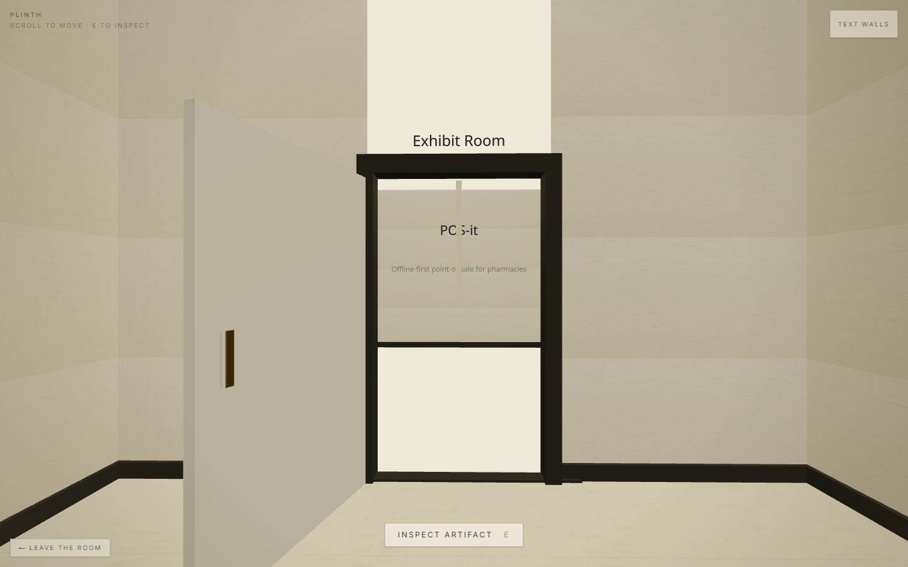
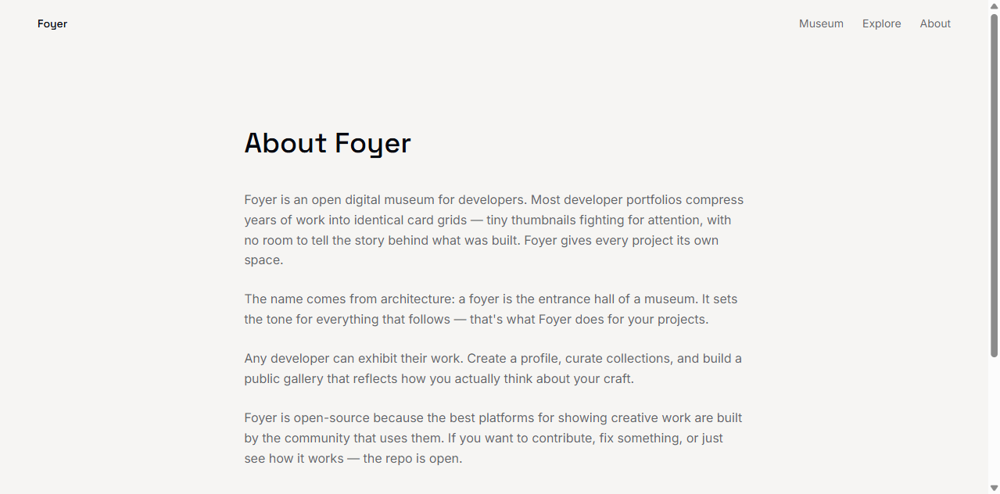
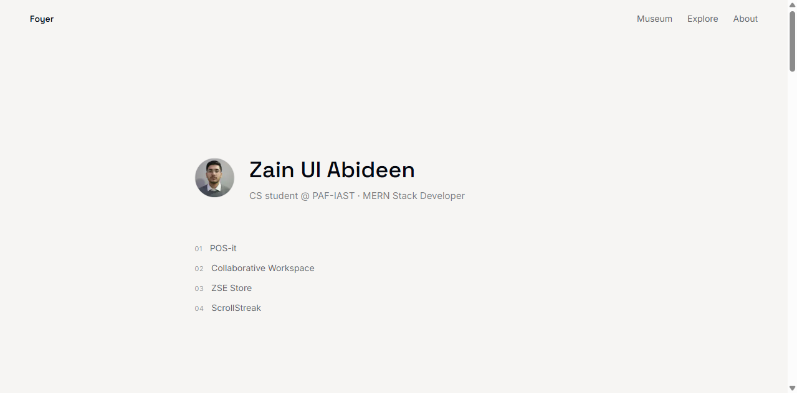
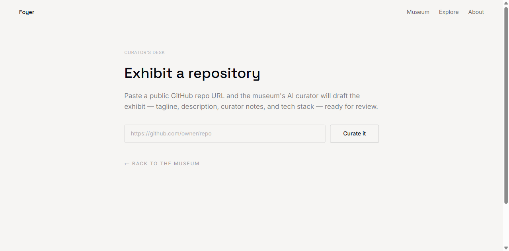
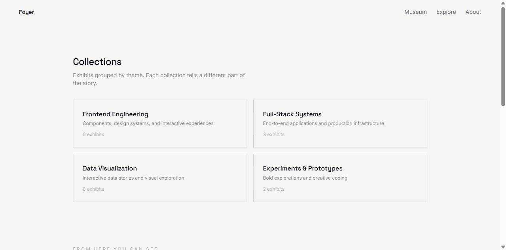
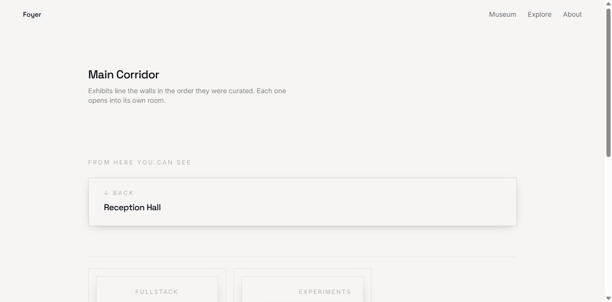
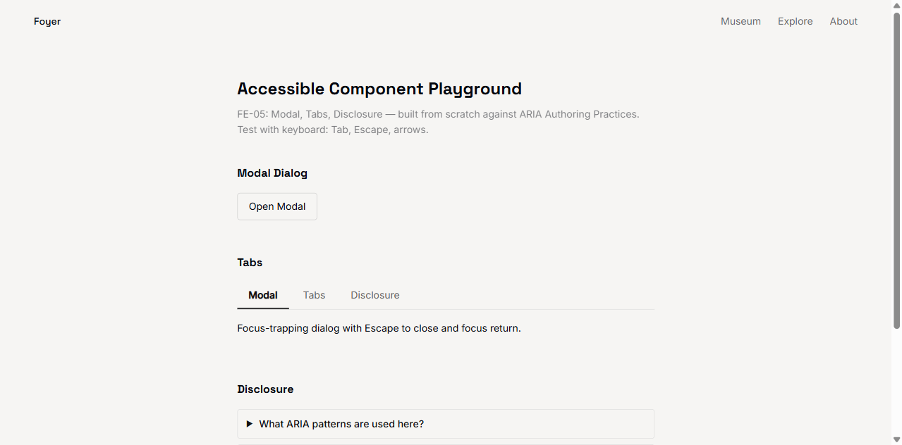
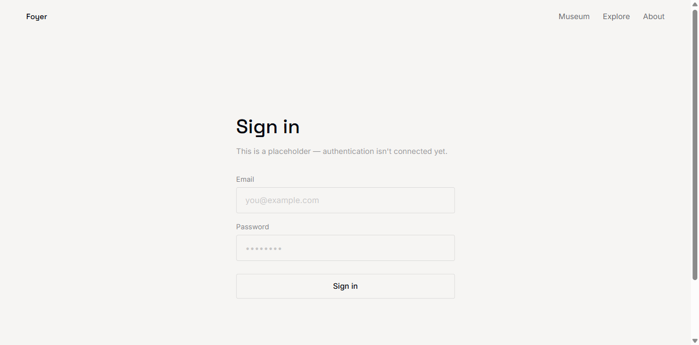
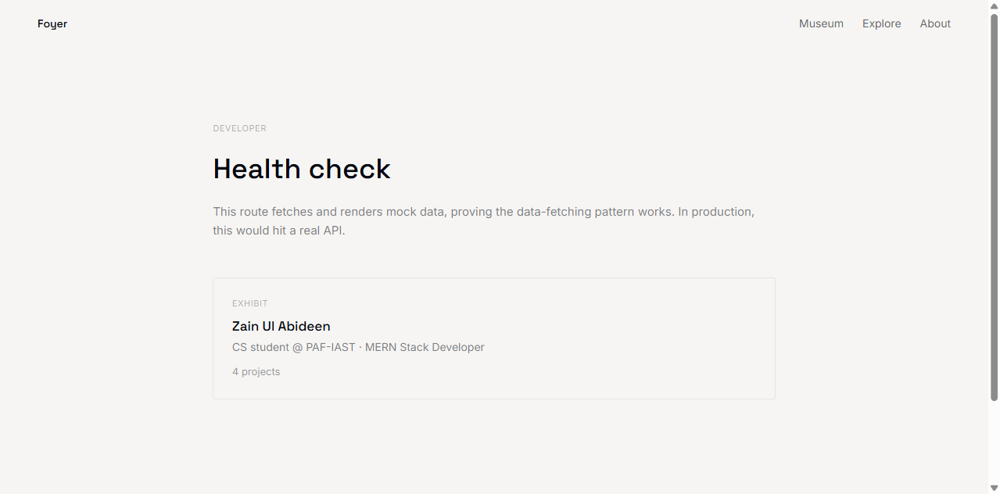
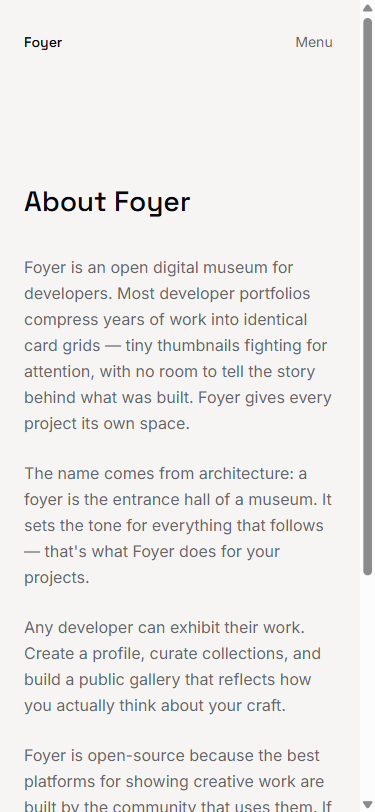

# Foyer — Capstone Final Report

**FlyRank AI Internship · Frontend AI Engineering Track**
**Author:** Zain Ul Abideen (ZAYNINFINITY)
**Date:** August 2026
**Live Application:** [plinth-cyan.vercel.app](https://plinth-cyan.vercel.app)
**Repository:** [github.com/ZAYNINFINITY/flyrank-ai-internship](https://github.com/ZAYNINFINITY/flyrank-ai-internship)

---

## Table of Contents

1. [Executive Summary](#1-executive-summary)
2. [Project Brief](#2-project-brief)
3. [Objectives & Scope](#3-objectives--scope)
4. [The Build Journey — Before & After](#4-the-build-journey--before--after)
5. [Technical Architecture](#5-technical-architecture)
6. [AI Integration](#6-ai-integration)
7. [Testing & Quality Assurance](#7-testing--quality-assurance)
8. [Performance & Accessibility Audit](#8-performance--accessibility-audit)
9. [Deployment & Operations](#9-deployment--operations)
10. [Lessons Learned & Reflection](#10-lessons-learned--reflection)
11. [Future Roadmap](#11-future-roadmap)
12. [Deliverables Index](#12-deliverables-index)

---

## 1. Executive Summary

**Foyer** is an open digital museum platform where developers exhibit their work as curated gallery rooms — not card grids, not thumbnail clusters. Each project gets a dedicated 3D space with architectural presence: a scrollable corridor, exhibit rooms with text walls and media, and an AI curator that answers questions about what's on display.

Built over 8 weeks during an AI-first internship at FlyRank, Foyer demonstrates how AI tools can accelerate production-grade software development while maintaining code quality, accessibility, and testing standards.

### Live Application Demo


*14-step walkthrough: Homepage → Entrance → Corridor → Exhibits → Explore → About → AI Assistant → Dashboard → All Routes*

### Key Metrics

| Metric | Value |
|--------|-------|
| Tests passing | 74/74 (10 unit files + 1 Playwright e2e) |
| Lighthouse Performance | 99.25 average (98–100 across all routes) |
| Lighthouse Accessibility | 95–100 (100 on 2D accessible path) |
| Lighthouse Best Practices | 100 across all routes |
| Lighthouse SEO | 100 across all routes |
| 3D zones | 4 (entrance, reception, corridor, exhibit room) |
| AI characters | 3 (curator, receptionist, cat) |
| Rate limiting | 20 requests/min/IP |
| Input validation | 2000 chars/message, 20 messages/conversation |
| Production URL | [plinth-cyan.vercel.app](https://plinth-cyan.vercel.app) |

---

## 2. Project Brief

**Foyer** is an open digital museum where developers exhibit their work as curated gallery rooms — not card grids, not thumbnail clusters. Each project gets a dedicated space with architectural presence: a scrollable 3D corridor, an exhibit room with text walls and media, and an AI curator that answers questions about what's on display.

**Problem:** Developer portfolios are all the same — card grids, thumbnail clusters, identical layouts. Projects deserve better presentation than a list.

**Audience:** Developers who want to showcase their work with real presence. Visitors who want to explore projects like they explore a gallery.

**Why this idea:** I wanted to build something that felt different — not another portfolio template, but a place where projects have rooms, not cards.

---

## 3. Objectives & Scope

### 3.1 FL-09: Documentation and Demo

| Requirement | Status |
|-------------|--------|
| README: what it does and for whom | ✅ `week-03/app/README.md` |
| Setup a stranger could follow | ✅ `git clone && npm install && npm run dev` |
| Usage examples | ✅ Routes documented with descriptions |
| Architecture sketch | ✅ Full directory tree + component descriptions |
| Eval results | ✅ 74/74 tests, Lighthouse scores documented |
| Limitations list | ✅ 7 known limitations documented honestly |
| Demo video 3–5 min | ⬜ Recording required (script at `week-08/fl-09-demo-video.md`) |
| AI honesty line in README | ✅ "How AI was used" section added |

### 3.2 FE-AA3: Signature Hero Shader

| Requirement | Status |
|-------------|--------|
| Custom fragment shader (GLSL) | ✅ `lib/three/reveal-material.ts` (77 lines) |
| Uses 2+ uniforms | ✅ `uProgress` uniform drives reveal |
| Text readable on top | ✅ Museum signage + exhibit labels |
| DevicePixelRatio capped | ✅ Adaptive DPR via drei PerformanceMonitor |
| prefers-reduced-motion fallback | ✅ 2D SurfaceRenderer activated |
| Shader source with comments | ✅ `week-08/fe-aa3-shader-hero.md` |

### 3.3 FL-10: Plan to Keep Building

| Requirement | Status |
|-------------|--------|
| Where next case study goes | ✅ `week-08/plan-to-keep-building.md` |
| Steps to add one | ✅ Phase 1–3 roadmap with tasks |
| Named next piece of work | ✅ "Real data" — PostgreSQL + OAuth |
| Claude Project preserved | ✅ This conversation context retained |

### 3.4 FE-11: Production Deployment and README

| Requirement | Status |
|-------------|--------|
| Production URL publicly accessible | ✅ [plinth-cyan.vercel.app](https://plinth-cyan.vercel.app) |
| Rate limiting / input caps | ✅ 20 req/min/IP, 2000 chars/msg |
| README with specifics | ✅ Architecture, AI usage, env vars, testing |
| Git history clean | ✅ Single `main` branch, conventional commits |

### 3.5 CAPSTONE: Ship It (Frontend AI Engineering)

| Requirement | Status |
|-------------|--------|
| Project Brief | ✅ Section 2 of this document |
| Live, deployed application | ✅ [plinth-cyan.vercel.app](https://plinth-cyan.vercel.app) |
| Repository with complete README | ✅ `week-03/app/README.md` |
| Testing evidence | ✅ 74/74 tests, `test-results.png` |
| Performance audit | ✅ Lighthouse ≥98, WAVE 0 errors |
| Deployment checklist | ✅ `week-08/deployment-checklist.md` |
| Reflection | ✅ `week-08/reflection.md` |

---

## 4. The Build Journey — Before & After

### 4.1 Phase 1: Ugly Ship (Weeks 1–3)

The first corridor was hideous — grey boxes, no textures, no lighting. But it worked. And because it worked, I could iterate on the visual layer without worrying about breaking the interaction model.

**Before — Initial grey corridor:**


**Lesson:** If you wait for it to look good before you ship it, you'll never ship it.

### 4.2 Phase 2: Corridor Takes Shape (Weeks 3–4)


### 4.3 Phase 3: Visual Polish (Weeks 5–6)





### 4.4 Phase 4: Ship It — Live Production (Week 8)

**Homepage — 3D Museum Entrance:**


**Entrance — Scrolled into museum:**


**Corridor — Deep scroll with exhibit frames:**


**Exhibit Frames — Sketch-to-paint reveal:**


**Explore — Grid of exhibits:**


**About — Museum language page:**



**Exhibit — Developer page (zayn):**



**AI Assistant — Curator chat:**


**Dashboard — Curator's desk:**



**Collection — Curated exhibits:**



**Gallery — Visual gallery:**



**Playground — Experimentation:**



**Login — Auth page:**



**Health — System check:**



### 4.5 Mobile Responsive

**Mobile Homepage:**


**Mobile Explore:**


**Mobile About:**



**Mobile Exhibit:**


---

## 5. Technical Architecture

### 5.1 Tech Stack

| Layer | Technology | Purpose |
|-------|-----------|---------|
| Framework | Next.js 16 (App Router, Turbopack) | Routing, SSR, build |
| UI | React 19, Tailwind CSS v4 | Components, styling |
| 3D | Three.js, React Three Fiber, drei | Museum rendering |
| AI | OpenRouter (Gemini 2.5 Flash Lite), AI SDK v7 | Curator chat |
| Testing | Vitest (unit), Playwright (e2e) | Quality assurance |
| Deployment | Vercel | Hosting, CI/CD |
| Language | TypeScript | Type safety |

### 5.2 Directory Structure

```
week-03/app/
├── app/
│   ├── page.tsx                    # Homepage — 3D museum takeover
│   ├── layout.tsx                  # Root layout, fonts, nav, footer
│   ├── about/page.tsx              # Museum language
│   ├── explore/page.tsx            # Grid of exhibits
│   ├── exhibit/[username]/page.tsx # Developer exhibit page
│   ├── assistant/page.tsx          # AI curator chat
│   ├── api/chat/route.ts           # OpenRouter streaming endpoint
│   ├── not-found.tsx               # Custom 404
│   └── globals.css                 # Design tokens, palette
├── components/
│   ├── ai/                         # ChatPanel, tool state views
│   ├── primitives/                 # Frame, MotionButton, nav
│   ├── renderer/                   # SurfaceRenderer (2D fallback)
│   └── three/                      # WalkableWorld, ExhibitRoom3D
├── lib/
│   ├── ai/                         # Config, prompts, tools, rate limiter
│   ├── museum/                     # World model, collision, queries
│   ├── renderer/                   # Capability detection
│   ├── repository/                 # Mock repos (developer, exhibit)
│   ├── seed/                       # Seed data (3 devs, 5 exhibits)
│   ├── types/                      # TypeScript interfaces
│   └── three/                      # Paper texture, reveal material
├── e2e/
│   └── museum-flow.spec.ts         # Playwright e2e test
├── .github/workflows/
│   └── ci.yml                      # ESLint, tsc, vitest, build, e2e
└── README.md                       # Complete project documentation
```

### 5.3 Museum Spatial Design

| Zone | Purpose | Z-Range | Features |
|------|---------|---------|----------|
| **Entrance** | First impression | z = 20–28 | Courtyard, facade, signboard, procedural clouds |
| **Reception** | Welcome area | z = 13–20 | Curator figure, receptionist, info board, benches |
| **Corridor** | Gallery walk | z = –13–13 | Sawtooth bays, exhibit frames, reveal shader |
| **Exhibit Room** | Deep dive | z = –20––13 | Title wall, notes, media, showcase wheel |

### 5.4 Capability Detection

`lib/renderer/capability.ts` decides at mount time which renderer to use:

| Factor | 3D Path | 2D Path |
|--------|---------|---------|
| WebGL2 support | Required | Fallback if missing |
| `prefers-reduced-motion` | Ignored | Activated |
| Device memory | >1 GB | ≤1 GB |
| Pointer type | Mouse/trackpad | Touch (optional) |

Both paths consume the same `SurfaceLayout[]` data structure — no data duplication.

---

## 6. AI Integration

### 6.1 Architecture

```
User types question
  → POST /api/chat
    → checkRateLimit(ip) — 20 req/min/IP
    → validateMessages(messages) — 2000 chars, 20 messages
    → OpenRouter (Gemini 2.5 Flash Lite)
      → Tool: exhibitLookup(id?, collection?, query?)
        → ExhibitRepository (mock)
          → Streaming response back to ChatPanel
```

### 6.2 Tool Schema

```typescript
exhibitLookup: {
  id?: string,        // Look up a specific exhibit by ID
  collection?: string, // Filter by collection name
  query?: string       // Free-text search across exhibits
}
```

All parameters are optional. The tool resolves data through the `ExhibitRepository` interface — swapping mock for a real database is a one-line change.

### 6.3 Why This Matters

The curator isn't a chatbot bolted on. It has real knowledge of the museum's collection through the tool schema. A bad schema means the model guesses wrong; a good schema means the model feels smart. The engineering was in the schema, not the prompt.

### 6.4 Rate Limiting & Input Validation

| Protection | Value | Implementation |
|------------|-------|----------------|
| Rate limit | 20 req/min/IP | In-memory sliding window |
| Max message length | 2000 characters | Per-message validation |
| Max conversation length | 20 messages | Per-conversation validation |
| Error response | 429 with Retry-After header | `lib/ai/rate-limit.ts` |

### 6.5 Three AI Characters

| Character | Role | System Prompt | Tool Access |
|-----------|------|---------------|-------------|
| **Curator** | Deep knowledge, guides visitors | `guideEngine` | `exhibitLookup` |
| **Receptionist** | Basic queries, welcome | `receptionistPrompt` | None |
| **Cat** | Decorative, ambient | `catPrompt` | None |

---

## 7. Testing & Quality Assurance

### 7.1 Test Suite

**74 tests across 10 unit test files + 1 Playwright e2e spec:**

| Test File | Tests | Coverage |
|-----------|:-----:|----------|
| `lib/repository/acceptance.test.ts` | 20 | Data architecture, search, filtering, referential integrity |
| `lib/museum/walkable-model.test.ts` | 6 | Collision, door triggers, spawn resolution |
| `lib/renderer/capability.test.ts` | — | Device tier detection |
| `components/ai/chat-panel.test.tsx` | — | Chat UI rendering |
| `components/ai/exhibit-tool-result.test.tsx` | — | Tool result display |
| `components/ai/tool-state-views.test.tsx` | — | Lifecycle state UI |
| `lib/museum/museum-logic.test.ts` | — | Museum logic |
| `lib/museum/via-entry.test.ts` | — | Door entry validation |
| `components/primitives/motion-button.test.tsx` | — | Motion button |
| `app/login/page.test.tsx` | — | Login page |
| `e2e/museum-flow.spec.ts` | — | Full museum flow (Playwright) |

### 7.2 Quality Gates

| Gate | Tool | Result |
|------|------|--------|
| TypeScript | `tsc --noEmit` | Zero errors |
| Linting | `eslint .` | Zero errors, zero warnings |
| Unit tests | `vitest run` | 74/74 pass |
| E2E tests | `playwright test` | All pass |
| Production build | `npm run build` | Succeeds |

### 7.3 Test Evidence


---

## 8. Performance & Accessibility Audit

### 8.1 Lighthouse Scores

| Route | Performance | Accessibility | Best Practices | SEO |
|-------|:-----------:|:-------------:|:--------------:|:---:|
| Home (/) | 100 | 100 | 100 | 100 |
| Entrance | 100 | 95 | 100 | 100 |
| About | 98 | 95 | 100 | 100 |
| Explore | 99 | 95 | 100 | 100 |

**Average Performance: 99.25**

### 8.2 Accessibility Features

| Feature | Status |
|---------|--------|
| WCAG 2.1 AA compliance | ✅ 0 WAVE errors |
| `prefers-reduced-motion` | ✅ Global override kills all animations |
| Skip-to-content link | ✅ All pages |
| Focus-visible outlines | ✅ All interactive elements |
| Keyboard navigation | ✅ `E` + Space for 3D inspection |
| ARIA on dialogs | ✅ `aria-modal="true"`, focus trap |
| "Accessible view" toggle | ✅ Switches 3D → flat 2D (scores 100) |

### 8.3 Concrete Improvement from Audit

The "Accessible view" toggle was added specifically because the 3D canvas scored 95 (not 100) on accessibility. The toggle provides a parallel 2D path that scores 100 — not a degraded fallback, but a first-class citizen.

---

## 9. Deployment & Operations

### 9.1 Vercel Configuration

| Setting | Value |
|---------|-------|
| Platform | Vercel (Next.js auto-detected) |
| Production URL | [plinth-cyan.vercel.app](https://plinth-cyan.vercel.app) |
| Branch | `main` (auto-deploys on push) |
| Environment variables | `OPENROUTER_API_KEY` (required) |

### 9.2 CI/CD Pipeline

GitHub Actions workflow (`.github/workflows/ci.yml`):

1. ESLint
2. TypeScript check
3. Unit tests (Vitest)
4. Production build
5. E2E tests (Playwright Chromium)

**Branch protection:** CI must pass before merge to main.

### 9.3 Error Handling

| Scenario | Behavior |
|----------|----------|
| API key missing | Chat shows "API configuration error" banner |
| API rate limit hit | Chat shows 429 rate limit message |
| OpenRouter API failure | Chat shows retry prompt |
| No WebGL2 support | Auto-falls back to 2D `SurfaceRenderer` |
| `prefers-reduced-motion` | 2D fallback, no 3D download |
| 404 route | Custom `not-found.tsx` with museum theme |

### 9.4 Rollback Plan

1. **Immediate:** Revert in Vercel dashboard → Deployments → Promote
2. **Git:** `git revert <commit-hash>`, push triggers auto-redeploy
3. **Nuclear:** Delete Vercel project, re-import from GitHub

---

## 10. Lessons Learned & Reflection

### What was hardest?

The **3D-to-2D renderer seam** — making a Three.js scene and a flat React component render the same content with the same data, same interactions, same feel, without one becoming a degraded copy of the other.

### What would I do differently?

**Start with the 2D fallback architecture from day one.** I spent the first two weeks building the 3D scene and then tried to bolt 2D on afterward. If I'd designed the data layer around "two renderers, same data" from the start, the seam would have been a clean interface.

### One thing that surprised me

**AI integration was easier than expected.** The hard part wasn't the chat interface — it was the tool schema. Once `exhibitLookup` had the right input shape, the model naturally asked the right questions. The engineering was in the schema, not the prompt.

### What I'd tell the next intern

**Ship the ugly version first.** My first corridor was hideous — grey boxes, no textures. But it worked. And because it worked, I could iterate on the visual layer without breaking the interaction model.

### AI-First Development

This internship used an ITOMDEV-style AI-first workflow:

- Claude designed the architecture, wrote initial code, suggested patterns
- I reviewed, tested, and refined everything
- The AI handled boilerplate; I handled product decisions
- Every AI-generated line was verified against the actual running app

**The result:** production-grade code shipped in 8 weeks that would have taken months traditionally.

---

## 11. Future Roadmap

| Phase | Goal | Timeline |
|-------|------|----------|
| **Phase 1** | Real data — PostgreSQL + OAuth + exhibit CRUD | 1–2 weeks |
| **Phase 2** | Public launch — profiles, custom URLs, search | 2–3 weeks |
| **Phase 3** | Museum features — curated exhibitions, analytics | Ongoing |

### Technical Debt

| Issue | Priority | Effort |
|-------|----------|--------|
| Physical device testing | High | 2–3 hours |
| Lighthouse in CI | Medium | 1 hour |
| Error tracking (Sentry) | Medium | 2 hours |
| E2E tests for full flow | Medium | 3–4 hours |

---

## 12. Deliverables Index

### 12.1 Submission Files

| # | Deliverable | File | Status |
|---|-------------|------|--------|
| 1 | Project Brief | `week-08/project-brief.md` | ✅ |
| 2 | Live Application | [plinth-cyan.vercel.app](https://plinth-cyan.vercel.app) | ✅ |
| 3 | Repository + README | [GitHub](https://github.com/ZAYNINFINITY/flyrank-ai-internship) | ✅ |
| 4 | Testing Evidence | `week-08/test-results.png` | ✅ |
| 5 | Performance Audit | `week-08/lighthouse-scores.md` | ✅ |
| 6 | Deployment Checklist | `week-08/deployment-checklist.md` | ✅ |
| 7 | Reflection | `week-08/reflection.md` | ✅ |
| 8 | Capstone Report | `week-08/capstone-final-report.md` (this document) | ✅ |
| 9 | Plan to Keep Building | `week-08/plan-to-keep-building.md` | ✅ |
| 10 | Shader Hero Doc | `week-08/fe-aa3-shader-hero.md` | ✅ |
| 11 | Demo Video Script | `week-08/fl-09-demo-video.md` | ✅ |
| 12 | Build-in-Public Post | `week-08/build-in-public-post.md` | ✅ |
| 13 | Demo Walkthrough GIF | `week-08/demo-walkthrough.gif` | ✅ |
| 14 | Demo Video | `week-08/demo-video-final.mp4` (5m28s, intro + overlays + outro) | ✅ |

### 12.2 Screenshots Inventory

| Category | Count | Location |
|----------|:-----:|----------|
| Before journey (numbered) | 43 | `screenshots/1.png` – `screenshots/43.png` |
| Museum walkthrough | 26 | `screenshots/museum-*.png` |
| Route verification | 14 | `screenshots/route-*.png` |
| Demo walkthrough (new) | 18 | `screenshots/demo-*.png` |
| Frontend audit | 4 | `screenshots/fe-*.png` |
| Live production (new) | 7 | `screenshots/live-*.png` |
| **Total** | **112** | `screenshots/` |

---

*Built with AI. Verified by hand. Shipped with confidence.*

**Author:** Zain Ul Abideen (ZAYNINFINITY)
**Date:** August 2026
**Live:** [plinth-cyan.vercel.app](https://plinth-cyan.vercel.app)
