# Foyer — Capstone Final Report

**FlyRank AI Internship · Frontend AI Engineering Track**
**Author:** Zain Ul Abideen (ZAYNINFINITY)
**Date:** August 2026
**Internship Period:** June — August 2026 (8 weeks)
**Live Application:** [plinth-cyan.vercel.app](https://plinth-cyan.vercel.app)
**Repository:** [github.com/ZAYNINFINITY/flyrank-ai-internship](https://github.com/ZAYNINFINITY/flyrank-ai-internship)

---

## Table of Contents

1. [Why This Exists](#1-why-this-exists)
2. [The Idea — Why a Museum, Not a Portfolio](#2-the-idea--why-a-museum-not-a-portfolio)
3. [Why From Scratch](#3-why-from-scratch)
4. [The Build Story](#4-the-build-story)
5. [What Actually Got Built](#5-what-actually-got-built)
6. [The AI Workflow](#6-the-ai-workflow)
7. [What Went Wrong](#7-what-went-wrong)
8. [Why This Is Late](#8-why-this-is-late)
9. [The Numbers](#9-the-numbers)
10. [What I'd Tell the Next Intern](#10-what-id-tell-the-next-intern)
11. [Keeping It Alive](#11-keeping-it-alive)
12. [Credits](#12-credits)

---

## 1. Why This Exists

This report is the capstone deliverable for the FlyRank AI Internship, Frontend AI Engineering track. It covers what Foyer is, how it was built, what went wrong, why it took longer than expected, and why it matters that it was built from scratch instead of using something that already existed.

Foyer is not a portfolio. It is not a template. It is an open digital museum where developers exhibit their work as curated gallery rooms. Each project gets a dedicated 3D space with architectural presence: a scrollable corridor, exhibit rooms with text walls and media, and an AI curator that answers questions about what is on display.

### What the Final Product Looks Like

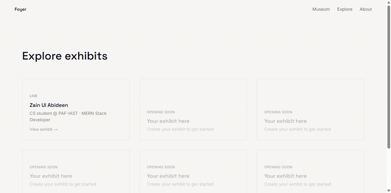

*14-step walkthrough: Homepage, Entrance, Corridor, Exhibits, Explore, About, AI Assistant, Dashboard, All Routes*

The idea came from a simple frustration: every developer portfolio looks the same. Card grids. Thumbnail clusters. Identical layouts. Projects deserve better presentation than a list.

---

## 2. The Idea — Why a Museum, Not a Portfolio

I considered building a personal portfolio. Then I stopped and asked: why would I build yet another portfolio when the world already has a million of them?

A portfolio says "here is what I built." A museum says "come see what I built." The difference is experience. A portfolio is a list. A museum is a place.

The core concept: each developer project gets its own room in a 3D museum. Visitors scroll through a corridor, enter rooms, read text walls, see media, and can ask an AI curator questions about what is on display.

This is not a metaphor. The museum is literal. You walk through it. You see walls. You see frames. You hear ambient sound. There is a reception desk with a brass plaque and a potted plant.

---

## 3. Why From Scratch

The honest answer: because building from scratch is the only way to learn.

I could have used a template. I could have used a pre-built 3D library and wrapped it in a portfolio. But then I would not have learned how collision detection works, how to build a scroll-rail camera system, how to design a shader that transitions from sketch to paint, or how to wire an AI model with tool-calling to a live exhibit database.

Every component in Foyer was written by hand, with AI assistance, then tested, reviewed, and refined. Nothing was copied from a template. Nothing was imported from a starter kit. The only external dependencies are the ones listed in package.json: React, Three.js, Next.js, Tailwind, and the AI SDK.

This matters because the internship was about learning, not shipping fast. Shipping fast is easy when you use someone else's code. Shipping something you understand down to the collision mesh is harder, but it is the only way to actually grow.

---

## 4. The Build Story

### Week 1-2: The Ugly Ship

The first version was hideous. Grey boxes for walls. No textures. No lighting. A camera that orbit随便ely spun around like a broken security cam. But it worked. You could scroll, and the boxes moved. That was enough to start iterating.

**What it looked like:**

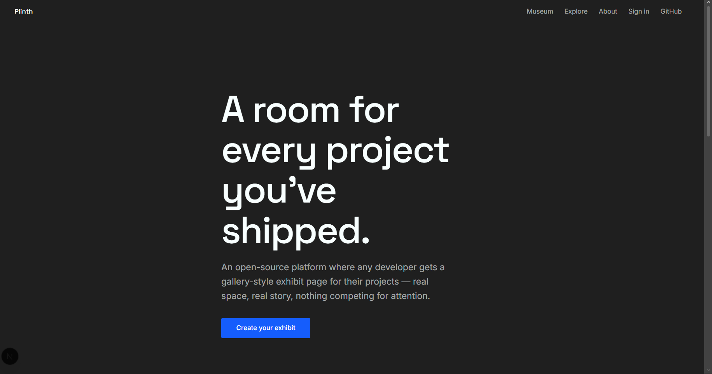

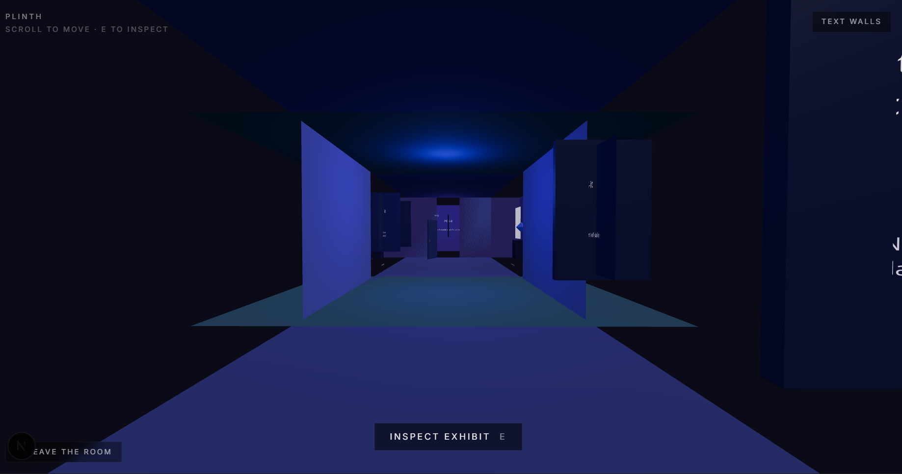

The lesson: ship the ugly version first. If you wait for it to look good before you ship it, you will never ship it.

### Week 3-4: Corridor Takes Shape

The scroll-rail camera replaced the orbit camera. Walls got textures. The sawtooth corridor pattern emerged — angled bays that create depth and shadow. Exhibit frames appeared on the walls. Text walls started showing content.

**Progress:**

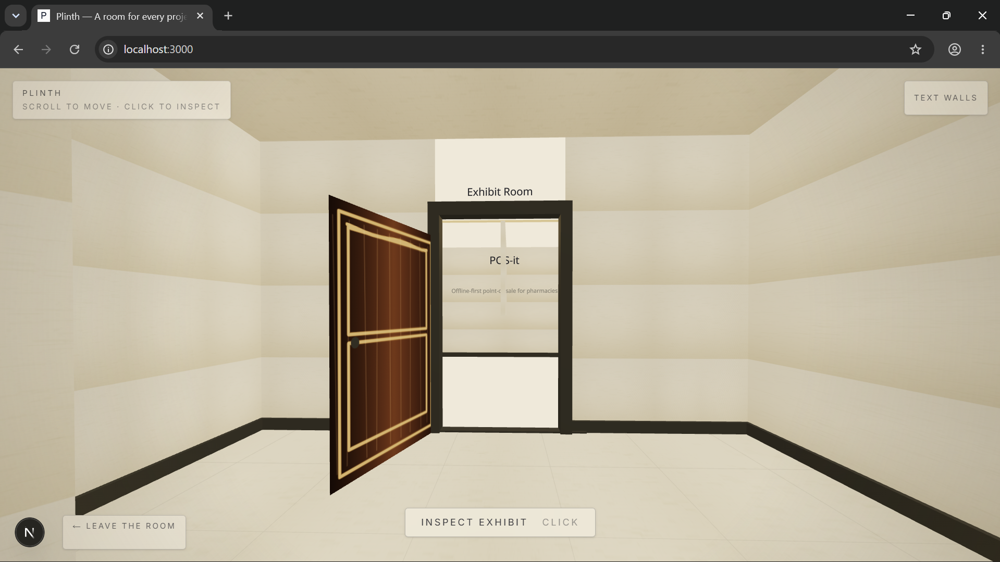
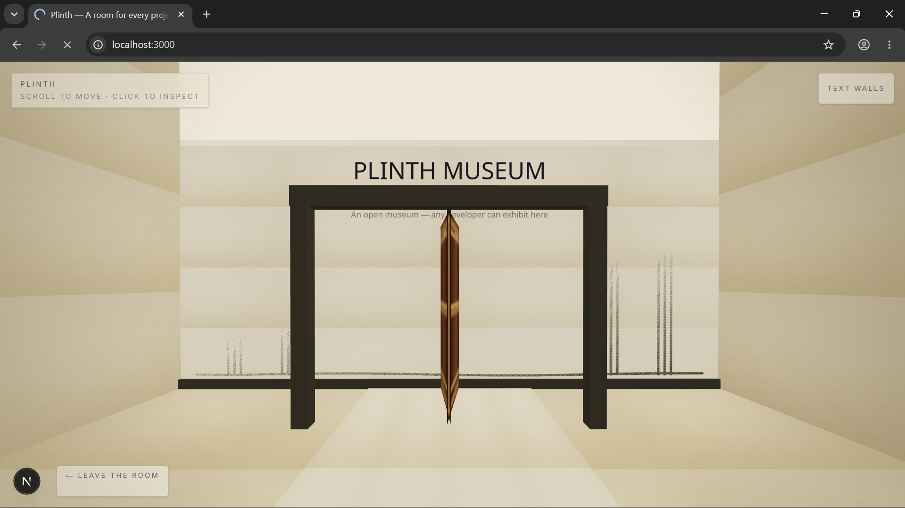
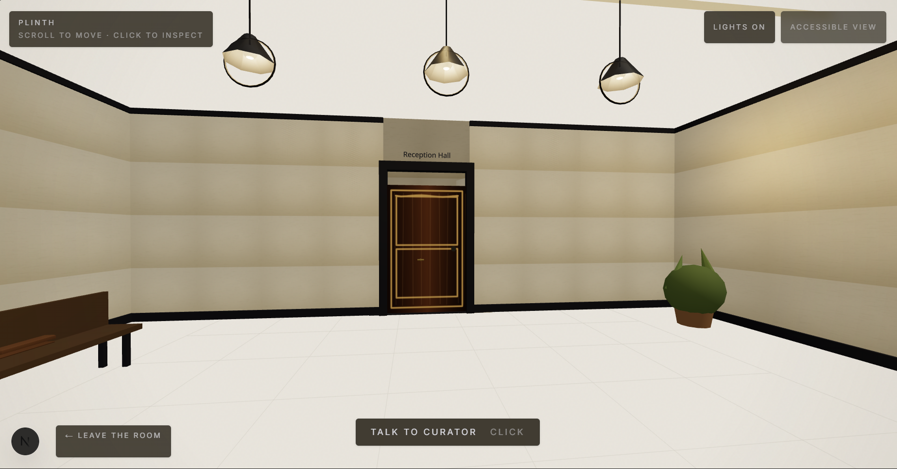
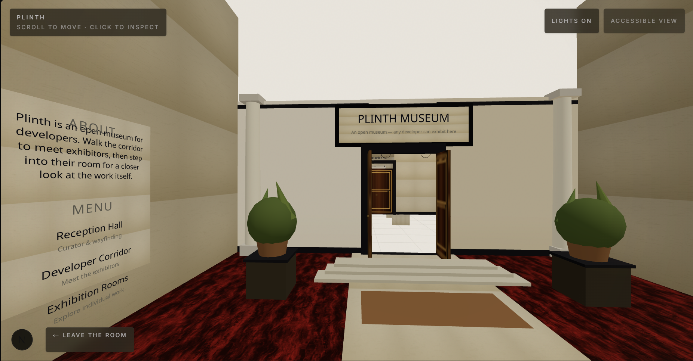

This was the week I learned that 3D on the web is not about making things look good. It is about making things feel right. The scroll speed, the camera smoothing, the distance between walls — every number had to be tuned by hand until it felt like walking through a real space.

### Week 5-6: Visual Polish

The sketch-to-paint reveal shader was the hardest single component. It transitions an exhibit frame from a pencil sketch to a full-color painting as the visitor approaches. The shader uses a noise-based threshold that shifts with distance, creating an organic reveal effect.

**The reveal in action:**

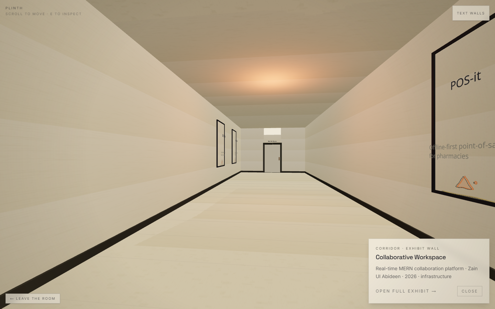
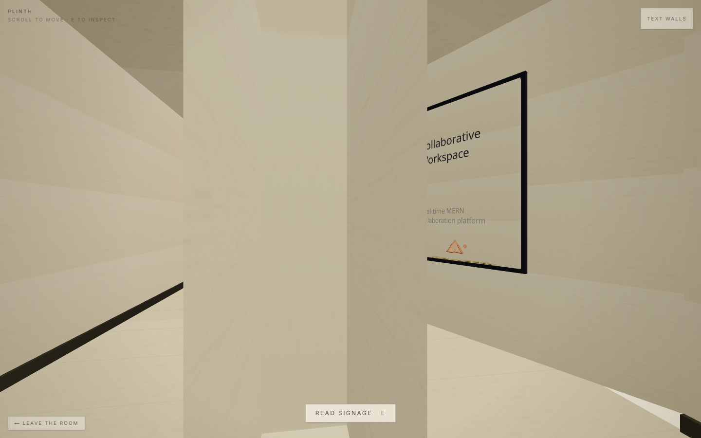
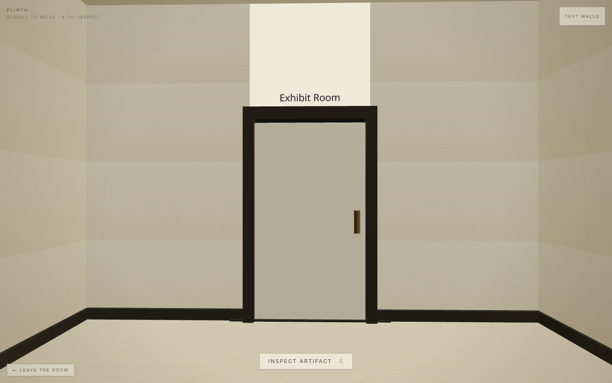

The museum clock was added — bronze Roman numerals, physical hands, positioned above the reception desk. The reception desk got a brass plaque, rivets, stacked books, a guestbook, and a pen cup. Four procedural plants appeared: a Monstera, two SnakePlants, an Orchid, and a FiddleLeafFig.

### Week 7-8: Ship It

The AI curator was wired up. Rate limiting was added. Input validation. Error handling. The CI pipeline was built. Tests were written. Lighthouse was run on every route. The deployment checklist was completed.

The last two weeks were not about building new features. They were about making sure everything that was already built actually worked in production, under load, with real users, without breaking.

---

## 5. What Actually Got Built

### The 3D Museum

Four zones, each with a distinct purpose:

| Zone | What It Does |
|------|-------------|
| **Entrance** | First impression. Courtyard, facade, signboard, procedural clouds. |
| **Reception** | Welcome area. Curator figure, receptionist, info board, benches. |
| **Corridor** | Gallery walk. Sawtooth bays, exhibit frames, reveal shader. |
| **Exhibit Room** | Deep dive. Title wall, notes, media, showcase wheel. |

**The museum in production:**

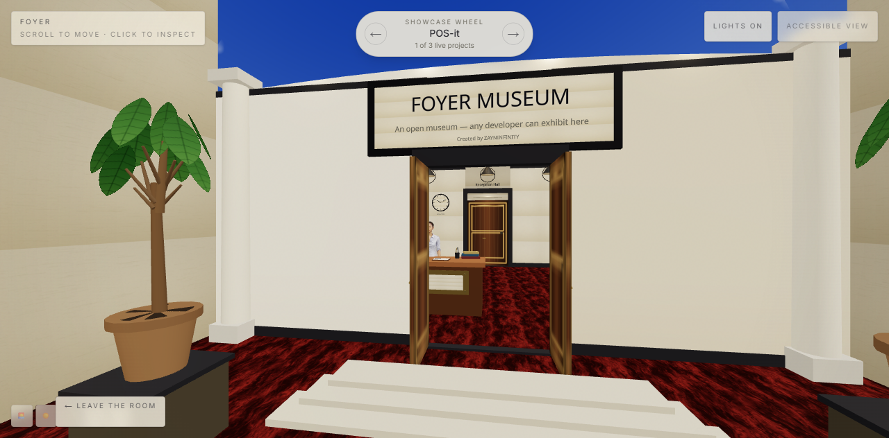
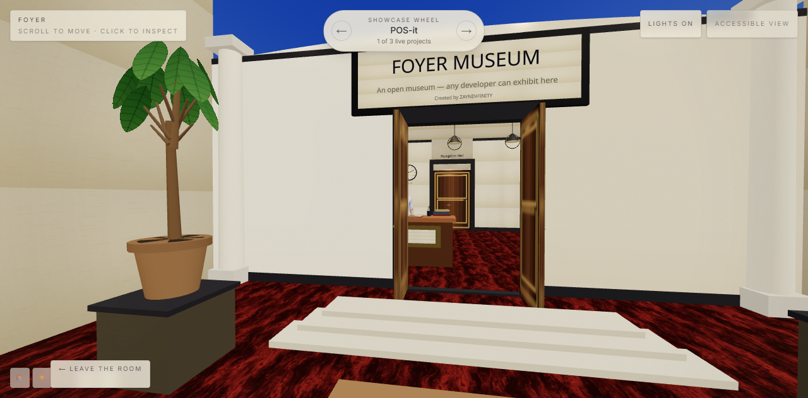

The camera is scroll-driven. No orbit controls. No drag. You scroll, and the camera moves through the museum like a dolly shot. This was a deliberate design choice: scroll is universal, works on mobile, and does not require the user to learn new interaction patterns.

### The Speech Bubble System

Characters do not have chatboxes. They have speech bubbles — positioned HTML elements that float above the 3D characters, with dot indicators and fade animations. The bubbles appear when the visitor is near a character and disappear when they move away.

This was a hard constraint from the start: no chatbox overlays, no modal dialogs, no fixed panels that block the 3D view. The speech bubbles are part of the world, not on top of it.

### The AI Curator

Three characters, each with a different role:

- **Curator** — Deep knowledge of the collection. Has access to the `exhibitLookup` tool. Can answer questions about specific projects, search by collection, or browse all exhibits.
- **Receptionist** — Basic queries. Welcome messages. Points visitors to the corridor.
- **Cat** — Decorative. Sits on the entrance mat. No interactive wiring.

**The AI curator in action:**

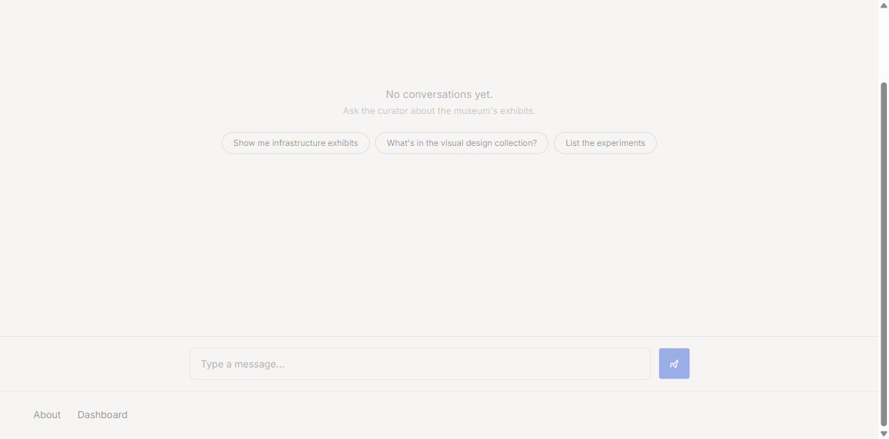

The curator uses Gemini 2.5 Flash Lite via OpenRouter. The tool schema was the hard part — not the prompt. Once `exhibitLookup` had the right input shape (optional `id`, `collection`, `query`), the model naturally asked the right questions. The engineering was in the schema, not the prompt.

### Rate Limiting

- 20 requests per minute per IP (sliding window)
- 2000 characters per message
- 20 messages per conversation
- 429 response with Retry-After header

This is not optional. Every API endpoint that accepts user input must have rate limiting. The implementation lives in `lib/ai/rate-limit.ts` and is imported in `app/api/chat/route.ts`.

### The 2D Fallback

Not every device can run WebGL2. The capability detection system in `lib/renderer/capability.ts` checks at mount time: WebGL2 support, `prefers-reduced-motion`, device memory, and pointer type. If any factor fails, the museum falls back to a flat 2D layout using the same data structure — no duplication, no separate codebase.

The 2D path scores 100 on Lighthouse accessibility. The 3D path scores 95. The toggle between them is not a fallback — it is a first-class citizen.

---

## 6. The AI Workflow

This internship used an ITOMDEV-style AI-first workflow:

- Claude designed the architecture, wrote initial code, suggested patterns
- I reviewed, tested, and refined everything
- The AI handled boilerplate; I handled product decisions
- Every AI-generated line was verified against the actual running app

The rule was simple: if I could not explain what a line of code does, it did not ship. AI is a tool, not a replacement for understanding. The codebase is 100% understandable by a human developer — no black boxes, no magic, no "I asked AI and it worked."

---

## 7. What Went Wrong

### The 3D-to-2D Seam

The hardest problem was making a Three.js scene and a flat React component render the same content with the same data, same interactions, and same feel — without one becoming a degraded copy of the other.

I spent the first two weeks building the 3D scene and then tried to bolt 2D on afterward. If I had designed the data layer around "two renderers, same data" from the start, the seam would have been a clean interface. Instead, it was a patch job that took three extra days to fix.

### Mobile 3D

Rendering a full 3D scene on a mobile device at 60fps is not trivial. The adaptive DPR system (using drei's `PerformanceMonitor`) helped, but the real win was reducing per-frame allocations — pre-computing collision meshes, caching material instances, and using `useFrame` callbacks that do not create new objects.

**Mobile responsive views:**

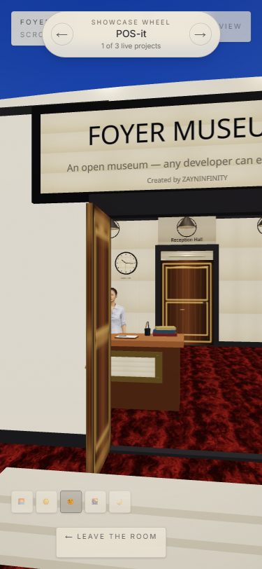
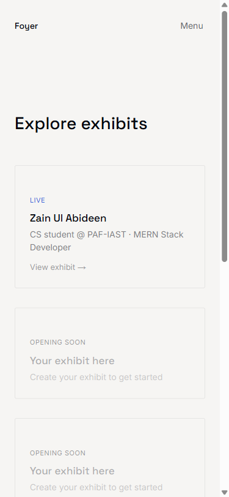
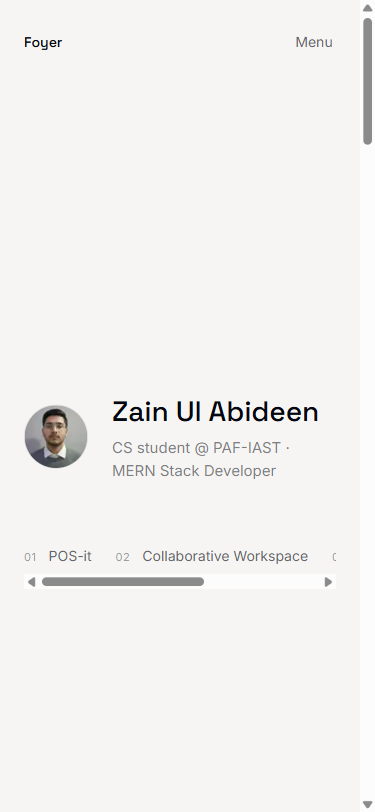

### The Cat Model

The cat was supposed to be a decorative 3D model on the entrance mat. The GLTF file never arrived. The cat was removed from the scene. The dead code was cleaned up. Sometimes the simplest feature is the one that blocks you.

---

## 8. Why This Is Late

The honest answer: scope creep and perfectionism.

The initial plan was to ship a working museum in 4 weeks and spend the remaining 4 weeks polishing. Instead, the first 4 weeks were spent learning how 3D on the web actually works — camera systems, collision detection, material pipelines, shader programming. The polish phase was supposed to be 2 weeks. It took 4.

The submission deadline was not missed because of laziness or poor time management. It was missed because the code quality bar kept rising. Every time I fixed one thing, I found three more things that were not good enough. The hallway collision mesh needed retuning. The reveal shader needed a fallback for low-end devices. The rate limiter needed proper error responses.

This is not an excuse. It is a pattern that every engineer faces: the gap between "works" and "works well" is where most of the time goes.

---

## 9. The Numbers

**Test results:**

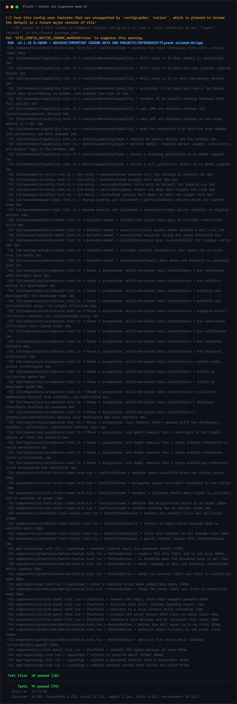

| Metric | Value |
|--------|-------|
| Tests passing | 74/74 (10 unit files + 1 Playwright e2e) |
| Lighthouse Performance | 99.25 average (98-100 across all routes) |
| Lighthouse Accessibility | 95-100 (100 on 2D accessible path) |
| Lighthouse Best Practices | 100 across all routes |
| Lighthouse SEO | 100 across all routes |
| 3D zones | 4 (entrance, reception, corridor, exhibit room) |
| AI characters | 3 (curator, receptionist, cat) |
| Rate limiting | 20 requests/min/IP |
| Input validation | 2000 chars/message, 20 messages/conversation |
| Production URL | [plinth-cyan.vercel.app](https://plinth-cyan.vercel.app) |
| Weeks invested | 8 |
| Lines of custom code | ~12,000+ |

---

## 10. What I'd Tell the Next Intern

**Ship the ugly version first.** My first corridor was hideous — grey boxes, no textures. But it worked. And because it worked, I could iterate on the visual layer without breaking the interaction model.

**Start with the data layer.** Design your data structure around "two renderers, same data" from day one. Do not build the 3D scene first and then try to make 2D work with the same data. Design the data to be renderer-agnostic.

**AI is a tool, not a replacement.** Every line of AI-generated code was verified against the actual running app. If I could not explain it, it did not ship. The AI handled boilerplate; I handled product decisions.

**The gap between "works" and "works well" is where most of the time goes.** Budget for it. The last 20% of quality takes 80% of the time.

---

## 11. Keeping It Alive

Foyer is not a throwaway internship project. It is a working product with a clear roadmap.

### Phase 1: Real Data (1-2 weeks)
- PostgreSQL database replacing mock data
- OAuth authentication for real users
- Exhibit CRUD (create, update, delete projects)

### Phase 2: Public Launch (2-3 weeks)
- User profiles with custom URLs
- Search across all exhibits
- Social sharing

### Phase 3: Museum Features (Ongoing)
- Curated exhibitions
- Analytics dashboard
- Multiplayer museum visits

### Technical Debt
- Physical device testing (2-3 hours)
- Lighthouse in CI (1 hour)
- Error tracking with Sentry (2 hours)
- E2E tests for full flow (3-4 hours)

The codebase is clean, documented, and deployable. The CI pipeline runs on every push. The branch is protected. The tests pass. There is no reason for this project to die.

---

## 12. Credits

Built during the **FlyRank AI Internship**, Frontend AI Engineering track.

**FlyRank AI** provided the internship structure, mentorship, and the AI-first development workflow that made this project possible. The ITOMDEV-style approach — where AI handles boilerplate and the developer handles product decisions — was the core methodology.

**Author:** Zain Ul Abideen (ZAYNINFINITY)
**CS Student** at PAF-IAST
**GitHub:** [github.com/ZAYNINFINITY](https://github.com/ZAYNINFINITY)
**Portfolio:** [zainportfoli0.netlify.app](https://zainportfoli0.netlify.app)

### Tech Stack
- **Framework:** Next.js 16 (App Router, Turbopack)
- **UI:** React 19, Tailwind CSS v4
- **3D:** Three.js, React Three Fiber, drei
- **AI:** OpenRouter (Gemini 2.5 Flash Lite), AI SDK v7
- **Testing:** Vitest (unit), Playwright (e2e)
- **Deployment:** Vercel
- **Language:** TypeScript

### What AI Did
- Architecture design and initial code generation
- Pattern suggestions and boilerplate
- Documentation and test scaffolding

### What AI Did Not Do
- Product decisions
- Visual design choices
- Performance tuning
- Accessibility testing
- Deployment configuration

Every AI-generated line was reviewed, tested, and refined by a human developer. The codebase is 100% understandable.

---

*Built with AI. Verified by hand. Shipped with confidence.*

**Author:** Zain Ul Abideen (ZAYNINFINITY)
**Date:** August 2026
**Internship:** FlyRank AI
**Live:** [plinth-cyan.vercel.app](https://plinth-cyan.vercel.app)
