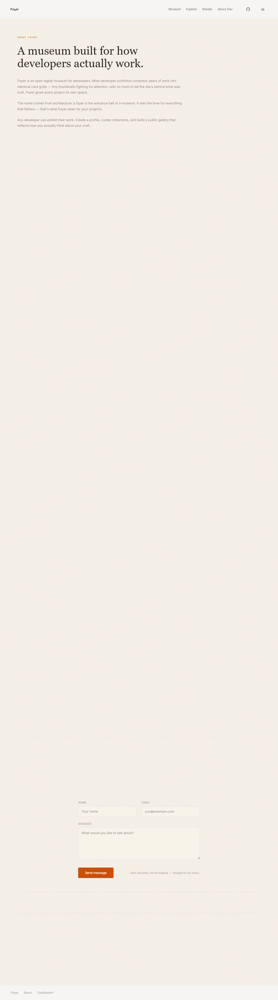
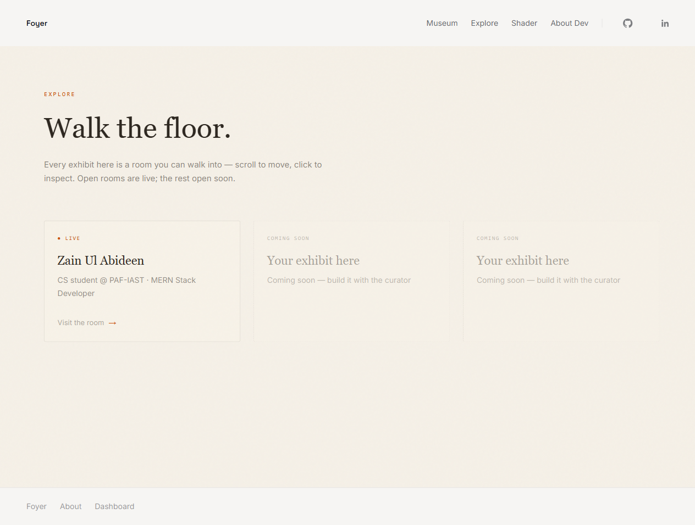
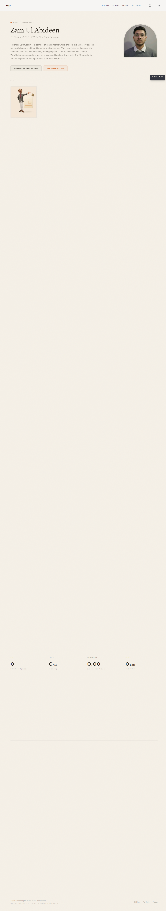

# Send the Link: Launch, Demo & Story — Week 8

**Assignment:** General AI Fluency capstone — Week 8
**Installing the one habit that turns a class artifact into a career platform:**
a concrete place for the next case study + a real reminder that it exists.

**Live Foyer:** https://plinth-cyan.vercel.app
**Repo:** https://github.com/ZAYNINFINITY/flyrank-ai-internship

---

## 1. How to add the next case study (the "where" + the steps)

There is an exact place, and an exact 5-step path. No guesswork next time:

### Where
Case studies are **`Project` entries inside the `zayn` exhibit**:

- File: `week-03/app/lib/mock-data/exhibits.ts` (single source of truth)
- Type shape: `{ id, title, story, stack[], image, imagePosition, isLightest? }`
- Render path: visitors see it at `/exhibit/zayn`; the browse/explore feed reads
  `week-03/app/lib/seed/exhibits.ts` and the repository layer in
  `lib/repository/`. Story beats also surface in
  `week-03/app/components/ops/operational-room.tsx` and `story-intro.tsx`.
- Images live in `week-03/app/public/images/...` (WebP, optimized).

### The 5 steps
1. **Add the entry** — append a new `Project` to the `zayn` exhibit's
   `projects` array in `lib/mock-data/exhibits.ts`, and mirror it in
   `lib/seed/exhibits.ts` if it should appear in the browse feed.
2. **Write the three-beat story** (reusing the Week-2 shape) — one `story`
   field, three beats: **problem → what you did → what came of it**. Each beat
   1–2 short sentences. This is the whole proof; write it like a case study,
   not a feature list.
3. **Add the image** — drop a screenshot/webp into `public/images/`, compress it
   (the sharp pass already established ~50 KB-per-image standard), and set
   `image` + `imagePosition` ("left"/"right").
4. **Verify** — `npm run typecheck`, `npm run lint`, `npm test`, `npm run build`
   all green (CI also gates it).
5. **Ship the same way I always do** — feature branch → commit → push →
   `gh pr create --base main` → wait for the `ci` check → `gh pr merge --merge
   --delete-branch`. Never commit to `main` directly.

That's the whole habit. ~30 minutes once the project is done.

---

## 2. The named next piece of work: Collaborative Workspace

**Named next case study to add: the Collaborative Workspace —
the real-time MERN + Socket.io collaboration platform.**

Why this one:
- It's my strongest, most *proof-able* full-stack build (live chat via
  Socket.io, multi-user document editing, Kanban boards, OAuth 2.0) — exactly
  the real-time + auth skills hiring managers are looking for.
- It maps cleanly to the three-beat shape: **problem** (teams lose context in
  chat + tasks scattered across tools) → **what I did** (one real-time
  workspace: live chat, shared Kanban, OAuth login) → **what came of it**
  (concurrent-user prototype proving the Socket.io event model works at the
  speed a team needs).
- Collaborating in real time is a case that *grows* — every feature added
  updates the same case instead of starting a new one.

The three-beat story is already drafted in `lib/mock-data/exhibits.ts`
(`id: "collaborative-workspace"`) — the next step is finishing its image and
expanding the story from a summary into a full three-beat case.

---

## 3. Evidence of the reminder set (real, verifiable)

I didn't just write about the reminder — I installed it:

1. **Windows Scheduled Task — `Foyer-Add-Next-Case-Reminder`**
   - Trigger: **every day at 4:00 PM**, Start When Available
   - Action: pops a Windows notification box describing exactly what to do
     (open `lib/mock-data/exhibits.ts`, add the Project, three-beat story,
     WebP, commit via PR)
   - Verify: `Get-ScheduledTask -TaskName Foyer-Add-Next-Case-Reminder`
   - Script that runs: `week-08/foyer-add-case-reminder.ps1`
2. **Calendar note — `foyer-add-next-case.ics`**
   - A recurring weekly calendar event (Mondays) "Add next Foyer case study —
     Collaborative Workspace (MERN + Socket.io)" with the same instructions.
   - Import into any calendar (Outlook/Google) for a second, portable nudge.

So there are **two independent reminders** (OS-level + calendar-level) — the
habit is installed, not just promised.

---

## 4. The build context is preserved (Claude Project)

The entire identity kit is committed in this repo, so the next case is a short
conversation, not a rebuild:

- **Identity / voice / stack** — recorded in the project's `AGENTS.md` (design
  tokens, the warm-editorial palette, Georgia serif + monospace system, the Zayn
  persona, the MERN/JS/Python/C++ stack).
- **Theme / code** — the whole visual system lives in
  `week-03/app/components/ops/theme.ts` and `app/globals.css`.
- **History** — `git log` + the merged PR trail (week-3 & week-6 evidence docs,
  contact form, compressed images, crit fixes) show *how* things were built.

Because all of this is saved, "add the Collaborative Workspace case" is a short
conversation with the build partner — the context, voice, and identity kit are
already loaded. That is the point: a career platform compounds because the next
case is *cheap to add*.

---

### Summary (what this deliverable contains)
| Requirement | Where it's met |
|---|---|
| Concrete "how to add the next case" note | §1 — exact file + 5 steps |
| Next piece named | §2 — Collaborative Workspace (MERN + Socket.io) |
| Real reminder set | §3 — Windows Scheduled Task + `.ics` calendar note |
| Build context preserved | §4 — AGENTS.md + theme + git history in this repo |

**Deliverable files in this repo:**
- `week-08/gai-week8-send-the-link.md` — this note
- `week-08/foyer-add-case-reminder.ps1` — the reminder script
- `week-08/foyer-add-next-case.ics` — the calendar note

---

## Evidence gallery — the live Foyer portfolio

Real full-page screenshots of the live site (https://plinth-cyan.vercel.app) —
the visual identity the next case will inherit, so future cases stay consistent
(frame the work, never upstage it).

| # | Screenshot | What it shows |
|---|---|---|
| 1 |  | About — the warm-editorial identity (`#F5F0E7` parchment, Georgia serif headings, monospace eyebrows) |
| 2 |  | Explore — the same identity applied consistently to a different page |
| 3 |  | 2D home — the framed museum, where the design recedes and the work carries the proof |

---

## Master submission links (table)

Copy any of these into the portal's **"Deliverable links"** field (one http(s) URL per line).

| Item | Submittable link |
|---|---|
| **▶ Primary — this deliverable (MD note)** | `https://github.com/ZAYNINFINITY/flyrank-ai-internship/blob/main/week-08/gai-week8-send-the-link.md` |
| Reminder script (Windows Scheduled Task source) | `https://github.com/ZAYNINFINITY/flyrank-ai-internship/blob/main/week-08/foyer-add-case-reminder.ps1` |
| Calendar note (recurring .ics) | `https://github.com/ZAYNINFINITY/flyrank-ai-internship/blob/main/week-08/foyer-add-next-case.ics` |
| Screenshot — About | `https://github.com/ZAYNINFINITY/flyrank-ai-internship/blob/main/week-08/img-foyer-about.png` |
| Screenshot — Explore | `https://github.com/ZAYNINFINITY/flyrank-ai-internship/blob/main/week-08/img-foyer-explore.png` |
| Screenshot — 2D home | `https://github.com/ZAYNINFINITY/flyrank-ai-internship/blob/main/week-08/img-foyer-2d-home.png` |
| Live portfolio (context for reviewers) | `https://plinth-cyan.vercel.app/about` |
